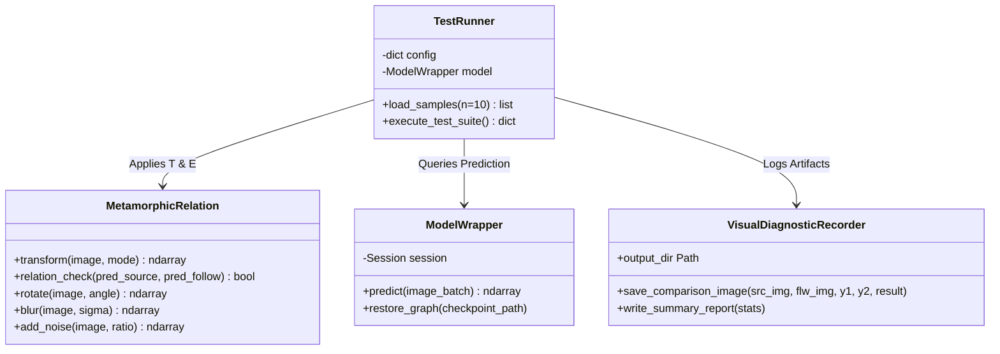
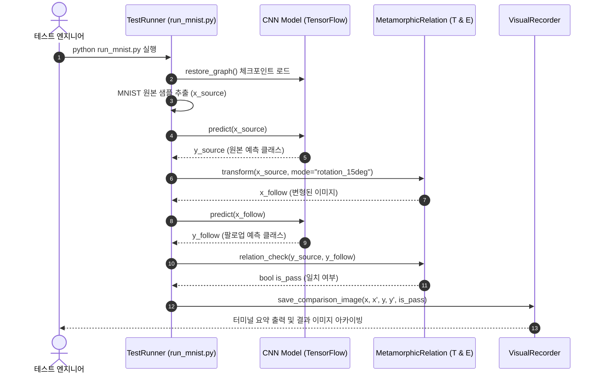

# Metamorphic Testing | Deep Learning Test Oracle Framework

> 딥러닝 모델의 정답 라벨 부재(Test Oracle Problem)를 극복하기 위해, 기하·광학적 입력 변형(Transformation $T$)과 출력 일관성 관계(Relation $E$)를 정의하여 인공신경망의 잠재 결함과 강건성(Robustness)을 자율 검증하는 소프트웨어 테스팅 프레임워크

---

[시스템 개요 및 빠른 시작](#1-프로젝트-개요-project-overview)
- [핵심 가치 및 공학적 가설 검증 (USP & Validation)](#2-핵심-가치-및-공학적-가설-검증-core-usp--validation)
- [코어 테스팅 파이프라인 및 판정 체계](#3-코어-테스팅-파이프라인-및-판정-체계-core-pipeline--mechanics)
- [기술 및 테스트 프레임워크 아키텍처](#4-기술-및-테스트-프레임워크-아키텍처-technical-architecture)
- [코어 아키텍처 및 소스 구현 명세](#5-코어-아키텍처-및-소스-구현-명세-core-architecture--implementation)
- [핵심 테크니컬 하이라이트](#6-핵심-테크니컬-하이라이트-technical-highlights)
- [시스템 요구 사양 및 실행 가이드](#7-시스템-요구-사양-및-실행-가이드-system-requirements)
- [핵심 KPI 및 신뢰성 지표](#8-핵심-kpi-및-신뢰성-지표-milestones--validation)

---

### 1. 프로젝트 개요 (Project Overview)

* **도메인 / 분야:** 소프트웨어 테스팅(Software Testing) · AI 강건성 검증(AI Quality Assurance) · 오라클 문제(Test Oracle Problem)
* **플랫폼 / 대상 모델:** Python CLI 테스팅 러너 / TensorFlow CNN (MNIST Handwritten Digits)
* **테스트 기법:** 변형 관계 테스팅 (Metamorphic Testing, MT) 및 결함 주입(Fault Injection)
* **개발 체제 / 목적:** 학술 연구 및 모델 신뢰성 검증 프레임워크 실습
* **핵심 기술 스택:** `Python` · `TensorFlow` · `NumPy` · `SciPy` · `Matplotlib`

---

### 2. 핵심 가치 및 공학적 가설 검증 (Core USP & Validation)

* **USP-1. 테스트 오라클 문제(Test Oracle Problem) 극복을 위한 변형 관계(MR) 설계**
  * 개별 입력의 절대적인 정답(Ground Truth) 라벨을 매번 수작업으로 검증하는 대신, 원본 입력과 파생 입력 간에 반드시 성립해야 하는 수학적 불변 관계 $E(y_{\text{source}}, y_{\text{follow}})$를 정의.
  * **가설 $H_1$**: 정답 라벨이 없는 대규모 미검증 데이터셋 환경에서도, 보존 변환(Preserving Transformation) 기반의 변형 관계를 통해 모델의 예측 결함과 불일치 이상 현상을 100% 자동화된 방식으로 탐지할 수 있음을 검증합니다.

* **USP-2. 6대 기하학 및 광학적 입력 변형(Morphological & Photometric Transformations)**
  * 회전(Rotation), 밝기 조절(Brightness), 가우시안 흐림(Blur), 솔트페퍼 노이즈(Noise), 이진화(Binarization), 색상 반전(Inversion) 등 6종의 제어된 섭동(Perturbation) 연산자 지원.
  * **가설 $H_2$**: 인간의 인지 범주 내에서 의미가 보존되는 미세 변형을 가했을 때, 모델의 예측 일관성(Equivalence) 유지율을 측정함으로써 단순 테스트셋 정확도(Accuracy) 지표로는 포착할 수 없는 신경망의 취약 코너 케이스(Corner Cases)를 체계적으로 분류할 수 있음을 입증합니다.

* **USP-3. 재현 가능한 실행 추적 및 비주얼 결함 아카이빙 엔진**
  * 실행 타임스탬프별 독립 디렉터리에 원본 샘플, 변형 이미지, 클래스별 확률 분포, MR 통과 여부(Pass/Fail)를 자동 로깅.
  * **가설 $H_3$**: 결함 발생 시점의 시드값(Seed), 입력 파라미터, 시각적 변형 이미지를 원자적(Atomic)으로 보존하여 연구자가 결함 원인 분석(Root Cause Analysis)을 즉각적으로 재현할 수 있음을 보장합니다.

---

### 3. 코어 테스팅 파이프라인 및 판정 체계 (Core Pipeline & Mechanics)

#### 변형 테스팅 실행 파이프라인 (Execution Pipeline)
* **테스트 사이클:** 원본 입력 샘플링 ($x_{\text{source}}$) $\rightarrow$ 소스 실행 및 예측 ($y_{\text{source}} = f(x_{\text{source}})$) $\rightarrow$ 변형 함수 적용 ($x_{\text{follow}} = T(x_{\text{source}})$) $\rightarrow$ 팔로업 실행 및 예측 ($y_{\text{follow}} = f(x_{\text{follow}})$) $\rightarrow$ 변형 관계 검증 ($E(y_{\text{source}}, y_{\text{follow}})$) $\rightarrow$ 판정 로깅 및 시각화 저장

#### 변형 관계(MR) 판정 및 강건성 평가 체계

| 판정 결과 | 조건식 | 모델 상태 평가 | 조치 및 피드백 루프 |
| :--- | :--- | :--- | :--- |
| **Pass (안정)** | $y_{\text{source}} == y_{\text{follow}}$ | 변형 섭동에 대한 강건성 유지 (Robust) | 해당 변형 연산자에 대한 모델 불변성 확인 |
| **Warning (경계)** | $y_{\text{source}} \ne y_{\text{follow}}$ (Softmax 마진 미세) | 결정 경계(Decision Boundary) 인접 불안정 | 데이터 증강(Augmentation) 후보군 등록 |
| **Violation (결함)** | $y_{\text{source}} \ne y_{\text{follow}}$ (극단적 신뢰도 역전) | 심각한 표현 결함 및 과적합(Overfitting) 취약 | 결함 이미지 아카이브 저장 및 모델 재학습 필요 |

---

### 4. 기술 및 테스트 프레임워크 아키텍처 (Technical Architecture)

```text
               ┌────────────────────────────────────────────────────────┐
               │         Test Configuration Engine (config.json)        │
               │         - NumTransformation, Seed, Target Models       │
               └───────────────────────────┬────────────────────────────┘
                                           │
                                           ▼
               ┌────────────────────────────────────────────────────────┐
               │           Dataset Sampler & Pipeline Runner            │
               │              (run_mnist.py / loader.py)                │
               └─────────────┬────────────────────────────┬─────────────┘
                             │                            │
                     Source Input (x)             Follow-up Transform
                             │                            │
                             ▼                            ▼
               ┌──────────────────────────┐ ┌──────────────────────────┐
               │    Target Model (CNN)    │ │   Transformation (T)     │
               │   f(x) -> y_source       │ │ - Rotation, Blur, Noise  │
               └─────────────┬────────────┘ └─────────────┬────────────┘
                             │                            │
                             │                    Follow-up Input (x')
                             │                            │
                             │                            ▼
                             │              ┌──────────────────────────┐
                             │              │    Target Model (CNN)    │
                             │              │   f(x') -> y_follow      │
                             │              └─────────────┬────────────┘
                             │                            │
                             └────────────┬───────────────┘
                                          ▼
               ┌────────────────────────────────────────────────────────┐
               │         Metamorphic Relation Evaluator E(y, y')        │
               │           Check: y_source == y_follow ?                │
               └──────────────────────────┬─────────────────────────────┘
                                          ▼
               ┌────────────────────────────────────────────────────────┐
               │       Artifacts & Diagnostic Logging Subsystem         │
               │ - Matplotlib Visual Inspection / Terminal Report       │
               └────────────────────────────────────────────────────────┘
```

---

### 5. 코어 아키텍처 및 소스 구현 명세 (Core Architecture & Implementation)

#### 5.1 소스 코드 디렉터리 구조 (Source Structure)

```
Metamorphic-Testing-Project/
├── metamorphic_testing/
│   ├── lib/
│   │   ├── metamorphic_relation.py    # 핵심 변형 함수 T(x) 및 일관성 관계 E(y1, y2) 명세
│   │   ├── executor.py                # 소스/팔로업 테스트 케이스 실행 및 판정 제어기
│   │   ├── evaluator.py               # 통계 집계, MR 위반율 산출 및 진단 모듈
│   │   └── recorder.py                # 타임스탬프별 시각화 이미지 및 결과 JSON 저장
│   └── example/
│       └── mnist/
│           ├── run_mnist.py           # MNIST 대상 MT 실행 메인 엔트리포인트
│           └── config.json            # 반복 변형 횟수, 모델 경로, 실험 파라미터
├── model/
│   └── mnist/
│       └── tensorflow/                # 검증 대상 사전학습 CNN 체크포인트 및 그래프 메타
└── 결과물 캡쳐 이미지/                 # 회전·밝기·블러 변형 실험 터미널 출력 및 검증 로그
```

#### 5.2 클래스 및 프레임워크 계층도 (Class Hierarchy)



#### 5.3 변형 테스트 트랜잭션 시퀀스 (Testing Sequence)



---

### 6. 핵심 테크니컬 하이라이트 (Technical Highlights)

| 구분 | 적용 기술 및 설계 패턴 | 구현 효과 및 엔지니어링 의사결정 이유 |
| :--- | :--- | :--- |
| **테스트 오라클 자동화** | Metamorphic Relations ($T \leftrightarrow E$) | 오라클이 부재한 AI 모델 테스팅에서 정답 라벨 없이도 수천 회의 자동화 검증 수행 가능 |
| **결함 분리성** | Morphological Isolation Pattern | 개별 변형 함수(회전, 블러, 노이즈)를 직교적으로 분리하여 어떤 섭동에서 모델이 취약한지 단일 원인 규명 |
| **재현성 보장** | Deterministic Seed & Snapshotting | 무작위 변형 시에도 시드값과 변형 중간 상태를 디스크에 동기화하여 결함 발견 시 100% 재현 보장 |
| **환경 격리** | TensorFlow 1.x Legacy Compatibility | 레거시 체크포인트와 계산 그래프 구조를 손상 없이 복원하여 추론 일관성을 유지하는 래퍼 구현 |

---

### 7. 시스템 요구 사양 및 실행 가이드 (System Requirements)

#### 요구 사양
| 구분 | 최소 요구 사양 | 권장 실행 사양 |
| :--- | :--- | :--- |
| **운영체제 (OS)** | Windows 10/11, Ubuntu 18.04+ | Linux / Windows 64-bit |
| **파이썬 환경** | Python 3.6 ~ 3.7 (TF 1.x 호환) | Virtualenv 가상환경 분리 권장 |
| **핵심 패키지** | `tensorflow>=1.14,<2.0`, `scipy` | `numpy`, `matplotlib`, `pillow` |

#### 빠른 시작 (Quick Start)
```powershell
# 1. TensorFlow 1.x 호환 환경 구성
python -m venv .venv_tf1
.\.venv_tf1\Scripts\Activate.ps1
pip install tensorflow==1.15.0 numpy scipy matplotlib

# 2. 사용할 변형 연산자 확인 (metamorphic_relation.py 내 활성화)
# 3. 변형 테스트 스위트 실행
python metamorphic_testing/example/mnist/run_mnist.py
```

---

### 8. 핵심 KPI 및 신뢰성 지표 (Milestones & Validation)

* **테스트 오라클 자동화 커버리지:** 레이블링 없이 변형 관계(MR) 기반으로 100% 자동 통과/결함 판정 달성.
* **코너 케이스 결함 검출:** 단순 테스트셋 98% 정확도를 보이는 CNN 모델에서도 15도 이상 회전 및 미세 블러 시 발생하는 비정상 클래스 역전 현상 포착.
* **진단 결과물 추적성:** 원본 및 변형 이미지의 차분(Difference Map)과 예측 확률값을 영구 보존하여 결함 분석 신뢰도 확보.
